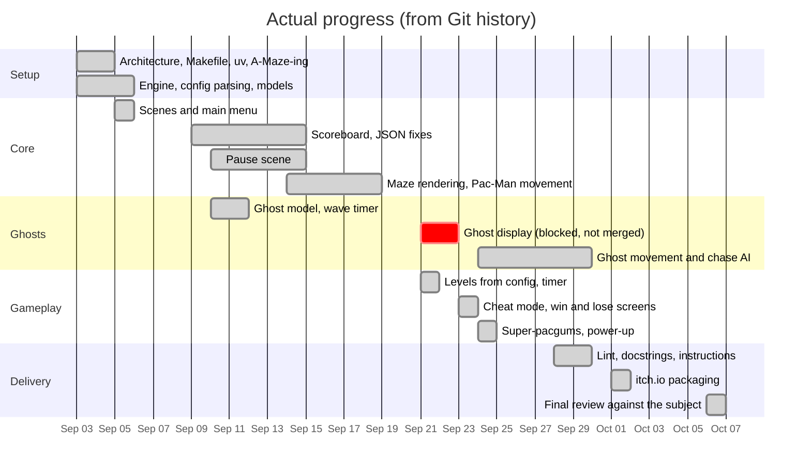

# Project Management Report — Pac-Man

Team: **loboehm**, **bgranier**
Repository: [github.com/YTlowlouis/pacman](https://github.com/YTlowlouis/pacman)
Period: **September 3 – October 6, 2026**

Every fact in this report comes from the Git history of the repository.
Links point to the matching pull requests (PR) and commits on GitHub.

---

## 1. Workflow

- **One branch per feature**: for example `gameengine`, `first_visual`,
  `logic_ghost`, `pacman_movement`, `gums_level_logic`, `fix_ghost`, `last`.
- **Pull requests to `main`**: **19 pull requests** were merged (#1 to #20, #6 is
  missing from the history).
- **Cross-review**: most pull requests were merged by the teammate who did
  **not** write the code. The person who clicks "merge" on GitHub is the author
  of the merge commit:

| PR | Branch | Code mainly by | Merged by |
|---|---|---|---|
| [#3](https://github.com/YTlowlouis/pacman/pull/3), [#5](https://github.com/YTlowlouis/pacman/pull/5) | `gameengine` | loboehm | bgranier |
| [#7](https://github.com/YTlowlouis/pacman/pull/7), [#8](https://github.com/YTlowlouis/pacman/pull/8), [#12](https://github.com/YTlowlouis/pacman/pull/12), [#13](https://github.com/YTlowlouis/pacman/pull/13) | `first_visual` | bgranier | loboehm |
| [#17](https://github.com/YTlowlouis/pacman/pull/17) | `pacman_movement` | bgranier, loboehm | bgranier |
| [#18](https://github.com/YTlowlouis/pacman/pull/18) | `gums_level_logic` | loboehm | bgranier |
| [#19](https://github.com/YTlowlouis/pacman/pull/19), [#20](https://github.com/YTlowlouis/pacman/pull/20) | `fix_ghost` | loboehm | bgranier, loboehm |

  Exception: [#10](https://github.com/YTlowlouis/pacman/pull/10) and
  [#11](https://github.com/YTlowlouis/pacman/pull/11) (`logic_ghost`) were
  written and merged by bgranier.
- **Two Git accounts for bgranier**: commits signed `DayraN19` were made by
  bgranier from another account.
- **Experimental branches stay out of `main`**: `ghost_draw` was never merged.
  Its author wrote it in the commit message ("ne pas merge" = "do not merge",
  [`40a1e03`](https://github.com/YTlowlouis/pacman/commit/40a1e03)).

<!-- TODO: add how the team communicated (Discord, in person...) and how
often. -->

---

## 2. Team Organization

Based on commit authorship (`git log`). Each line links to the main commits.

| Area | Main contributor | Evidence |
|---|---|---|
| Repository setup: `src/` architecture, Makefile, uv, `.gitignore`, A-Maze-ing package | loboehm | [`4794a14`](https://github.com/YTlowlouis/pacman/commit/4794a14), [`93ad967`](https://github.com/YTlowlouis/pacman/commit/93ad967), [`c36b82d`](https://github.com/YTlowlouis/pacman/commit/c36b82d) |
| Base classes `Sprite`, `PacMan`, `PacGum`, ghost inheritance | bgranier | [`edaa03e`](https://github.com/YTlowlouis/pacman/commit/edaa03e), [`481e3f0`](https://github.com/YTlowlouis/pacman/commit/481e3f0), [`c87721f`](https://github.com/YTlowlouis/pacman/commit/c87721f) |
| Engine, config parsing, pydantic models | loboehm | [`d26eaba`](https://github.com/YTlowlouis/pacman/commit/d26eaba), [`38b69b5`](https://github.com/YTlowlouis/pacman/commit/38b69b5), [`c09b0c9`](https://github.com/YTlowlouis/pacman/commit/c09b0c9) |
| Scene system and main menu | loboehm | [`7f08c40`](https://github.com/YTlowlouis/pacman/commit/7f08c40) |
| Scoreboard: load, save, sort, models | loboehm | [`d4dfd69`](https://github.com/YTlowlouis/pacman/commit/d4dfd69), [`803fd45`](https://github.com/YTlowlouis/pacman/commit/803fd45), [`9da50d5`](https://github.com/YTlowlouis/pacman/commit/9da50d5) |
| Pause scene | bgranier | [`1b67f08`](https://github.com/YTlowlouis/pacman/commit/1b67f08), [`1bba4cd`](https://github.com/YTlowlouis/pacman/commit/1bba4cd), [`5b527c7`](https://github.com/YTlowlouis/pacman/commit/5b527c7) |
| Ghost wave timer (`WaveManager`), first ghost model | bgranier | [`747af51`](https://github.com/YTlowlouis/pacman/commit/747af51), [`f6ed38b`](https://github.com/YTlowlouis/pacman/commit/f6ed38b) |
| Maze rendering, Pac-Man movement, pacgums | loboehm | [`3ae4ff5`](https://github.com/YTlowlouis/pacman/commit/3ae4ff5), [`57e7f24`](https://github.com/YTlowlouis/pacman/commit/57e7f24) |
| Ghost display | bgranier | [`b9430d9`](https://github.com/YTlowlouis/pacman/commit/b9430d9) to [`53a7ec4`](https://github.com/YTlowlouis/pacman/commit/53a7ec4) (branch `ghost_draw`) |
| Fonts, assets, lint | bgranier | [`3a671c0`](https://github.com/YTlowlouis/pacman/commit/3a671c0), [`beec9c9`](https://github.com/YTlowlouis/pacman/commit/beec9c9) |
| Levels from config, level timer | loboehm | [`aa65393`](https://github.com/YTlowlouis/pacman/commit/aa65393) |
| Cheat mode, win and lose screens, scores at game over | loboehm | [`d686bb6`](https://github.com/YTlowlouis/pacman/commit/d686bb6), [`959c8c7`](https://github.com/YTlowlouis/pacman/commit/959c8c7) |
| Ghost movement and chase AI | loboehm | [`111d6a9`](https://github.com/YTlowlouis/pacman/commit/111d6a9), [`9cc8026`](https://github.com/YTlowlouis/pacman/commit/9cc8026), [`81f8118`](https://github.com/YTlowlouis/pacman/commit/81f8118) |
| Super-pacgums and power-up | loboehm | [`3dd4635`](https://github.com/YTlowlouis/pacman/commit/3dd4635) |
| Victory flag on the end screen | bgranier | [`d8f4d1f`](https://github.com/YTlowlouis/pacman/commit/d8f4d1f) |
| Instructions screen, docstrings | loboehm | [`b09d915`](https://github.com/YTlowlouis/pacman/commit/b09d915), [`b90b15d`](https://github.com/YTlowlouis/pacman/commit/b90b15d) |
| itch.io packaging (PyInstaller), eaten ghost and super power animation | bgranier | [`a7dde80`](https://github.com/YTlowlouis/pacman/commit/a7dde80) |

<!-- TODO: explain how decisions were made, and confirm or correct the
table above (commit authorship does not show pair programming). -->

---

## 3. Timeline and Actual Progress

The chart below shows the **actual** progress, rebuilt from the commit and
pull request dates.

| Week | Work done | Pull requests |
|---|---|---|
| **Sep 3 – 6** | Repository setup, `src/` architecture, Makefile, uv, A-Maze-ing package. Engine, config parsing and pydantic models. Base classes. Scene system and main menu. | [#1](https://github.com/YTlowlouis/pacman/pull/1) – [#5](https://github.com/YTlowlouis/pacman/pull/5) |
| **Sep 7 – 13** | JSON parsing fixes and tests. Scoreboard scene and score sorting. First maze display. Ghost model, wave timer, pause scene. | [#7](https://github.com/YTlowlouis/pacman/pull/7) – [#11](https://github.com/YTlowlouis/pacman/pull/11) |
| **Sep 14 – 20** | Merge conflicts fixed. Score models. Maze rendering and reloading. Pac-Man texture and movement, pacgums. | [#12](https://github.com/YTlowlouis/pacman/pull/12) – [#16](https://github.com/YTlowlouis/pacman/pull/16) |
| **Sep 21 – 27** | Ghost display attempts (blocked). Fonts, assets, lint. Levels and timer from config. Cheat mode, win and lose screens. Ghost movement. Super-pacgums. Pac-Man spawn in the middle. | [#17](https://github.com/YTlowlouis/pacman/pull/17), [#18](https://github.com/YTlowlouis/pacman/pull/18) |
| **Sep 28 – Oct 1** | Lint. Ghost chase fixes. Docstrings. Instructions screen. Name input after a victory. Points for eaten ghosts. itch.io packaging. | [#19](https://github.com/YTlowlouis/pacman/pull/19), [#20](https://github.com/YTlowlouis/pacman/pull/20), branch `last` |
| **Oct 6** | Final review against the subject: error handling, paths, highscore rules, README, Makefile, dependencies, dead code. | branch `last` |

---

## 4. Project Analysis and Technical Choices

| Choice | Why |
|---|---|
| **pygame-ce** as graphical library | Close to MLX: opening a window, loading and drawing images, drawing lines and rectangles, keyboard events. It is easy to install with pip and uv. |
| **Scene-based architecture** (`Engine` + `Scene`) | Each screen (menu, game, pause, end screen, scoreboard, instructions) is its own class with `handle_event`, `update` and `draw`. Screens can be added without touching the game loop. |
| **pydantic models** for config and scores | All values are validated in one place (types, ranges, name rules). |
| **Faulty config: clamp and continue** | The config is changed during the defense. A wrong value prints a message and uses a safe default instead of stopping the game. |
| **Grid movement with interpolation** | Collisions are simple (wall bits of the cell) while the movement still looks smooth. |
| **Ghost AI inspired by the arcade game** | Scatter and chase waves, and one target per ghost. It is cheap to compute and gives each ghost its own behavior. |
| **JSON file for highscores** | Readable, editable by hand for tests, no dependency, enough for 10 entries. |
| **PyInstaller** for packaging | Builds a game that runs without Python installed. The `pacman.spec` file is in the repository so the package can be rebuilt. |

---

## 5. Risk Analysis and Mitigation

| Risk | Impact | Mitigation |
|---|---|---|
| The assigned A-Maze-ing package cannot be modified, and its format is unknown at first | Critical | Our loader reads its format: wall bits 1/2/4/8, and cells equal to 15 for the "42" pattern. Pac-Man spawns on the free cell closest to the center. Errors raised by the generator stop the game with a clear message. |
| The config file is changed during the defense | High | Every value is type-checked and clamped, with a log message. Unknown keys are ignored. Missing file or invalid JSON: clear error, no traceback. |
| A crash during the defense means the project fails | Critical | `try/except` around the config, the maze generator and the assets. Highscore file errors never stop the game. |
| Merge conflicts between feature branches | Medium | Feature branches, pull requests reviewed by the other teammate, experimental work kept on its own branch (`ghost_draw`). |
| Ghost AI takes longer than planned | Medium | Started with a simple model (wave timer), then iterated on movement and chase targets ([#19](https://github.com/YTlowlouis/pacman/pull/19), [#20](https://github.com/YTlowlouis/pacman/pull/20)). |
| Asset paths break when the game is packaged or launched from another folder | High | All paths are built from the project root, or from the PyInstaller folder when packaged. |

---

## 6. Blocking Points and Conflicts

- **Ghost display (September 21–24).** Showing and moving the ghosts was the
  main blocking point. Commit messages show it: "ghost marche pas" (does not
  work), "je comprends rien" (I don't understand anything)
  ([`40a1e03`](https://github.com/YTlowlouis/pacman/commit/40a1e03),
  [`53a7ec4`](https://github.com/YTlowlouis/pacman/commit/53a7ec4)). The
  `ghost_draw` branch was not merged. Ghost movement was then written again
  in `RunningScene` ([`111d6a9`](https://github.com/YTlowlouis/pacman/commit/111d6a9)),
  and the chase behavior was fixed later in `fix_ghost`.
- **Merge conflicts (September 14–15).** Parallel work on the engine and the
  scenes caused conflicts
  ([`55cb0fb`](https://github.com/YTlowlouis/pacman/commit/55cb0fb), "fix
  conflict"). `main` was merged back into `develop`
  ([#14](https://github.com/YTlowlouis/pacman/pull/14),
  [#15](https://github.com/YTlowlouis/pacman/pull/15)) to resynchronize the
  branches.
- **Documentation out of sync (October 6).** The first README and report
  described features that the game does not have. Both were rewritten from
  the actual code during the final review.

---

## 7. Use of AI

- One commit was written by an AI assistant: [`f4e7e4e`](https://github.com/YTlowlouis/pacman/commit/f4e7e4e)
  ("Instancie et fait bouger Pacman dans RunningScene" = "Creates Pac-Man and
  makes him move in RunningScene"). It was reviewed and reworked afterwards
  ([`57e7f24`](https://github.com/YTlowlouis/pacman/commit/57e7f24)).
- During the final review (October 6), Claude Code was used to:
  - check the project against the subject,
  - add the error handling,
  - rewrite the README and this report from the Git history.

  Each change was explained step by step, tested, and accepted by the team.

